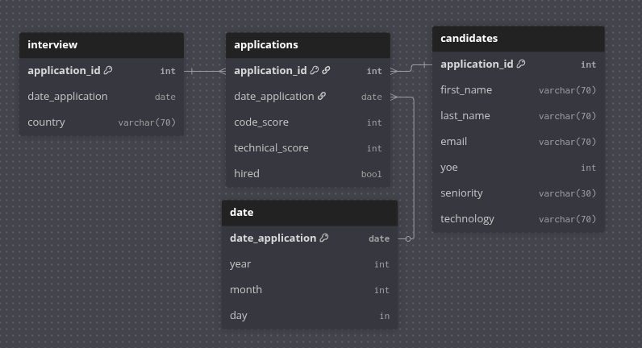

# ETL Workshop - Data Engineer Challenge

## Faculty & Program
**Faculty:** Faculty of Engineering and Basic Sciences  
**Program:** Data Engineering and Artificial Intelligence  
**Course:** ETL (G01)  
**Workshop:** Workshop-1: Data Engineer  

## Introduction
This project simulates a real job interview challenge. The goal is to design and implement a full ETL pipeline: extract data from a CSV file, transform it according to business rules (HIRED = both scores ≥ 7), load it into a Data Warehouse (DW), and build KPIs and visualizations from the DW using Dash.

## Getting Started
You will receive a CSV file (`data/candidates.csv`) with 50,000 rows. ETL steps: design a Star Schema (Fact table: applications, Dimension tables: candidate, date, interview, diagram + justification in `DW/diagram`), extract CSV, apply HIRED rule, compute KPIs, load into DW (SQLite). KPIs & Visualizations: Hires by Technology (total hires grouped by technology), Hires by Year (total hires per year), Hires by Seniority (total hires grouped by seniority), Hires by Country over Years (focus on USA, Brazil, Colombia, Ecuador), Hires by Month for a Year (monthly hires for a given year), Total Applications vs Hires (comparison of all applications and hires).

## Technologies & Setup
Install dependencies: `pip install -r requirements.txt`. Key Libraries: dash, flask, pandas, numpy, plotly. Linux / distros: recommended to create a virtual environment: `python3 -m venv .venvEtl`, `source .venvEtl/bin/activate`, `pip install -r requirements.txt`.

## Project Structure
.
├── applications.db            # Base de datos SQLite generada al cargar los datos
├── dashboard/                 # Carpeta del dashboard (visualización con Dash/Plotly)
│   ├── graphs.py              # Definición de gráficos y componentes visuales
│   └── __pycache__/           # Archivos compilados de Python (se pueden ignorar)
│
├── data/                      # Fuente de datos iniciales
│   ├── candidates.csv         # Dataset principal con información de candidatos
│   └── __pycache__/           # Archivos compilados (se ignoran)
│
├── DW/                        # Carpeta para documentación del Data Warehouse
│   ├── Captura...png          # Imagen (ej. captura del diagrama del DW)
│   └── diagram                # Archivo del diagrama (MER/DER, según herramienta)
│
├── extract/                   # Módulo de extracción (E en ETL)
│   ├── dataExtraction.py      # Funciones para leer datos desde CSV/otros formatos
│   ├── querys.py              # Consultas auxiliares relacionadas a extracción
│   └── __pycache__/           # Archivos compilados
│
├── load/                      # Módulo de carga (L en ETL)
│   ├── dataLoad.py            # Funciones para cargar datos transformados a SQLite
│   └── __pycache__/           # Archivos compilados
│
├── transform/                 # Módulo de transformación (T en ETL)
│   ├── dataTansformation.py   # Funciones para limpiar, procesar y transformar datos
│   └── __pycache__/           # Archivos compilados
│
├── main.py                    # Script principal que orquesta el pipeline ETL
├── README.md                  # Documentación del proyecto
├── requirements.txt           # Dependencias necesarias para correr el proyecto
└── __pycache__/               # Archivos compilados de main (ignorar)

## SCHEMA

## Star Schema Justification

The dimensional model is designed as a star schema, with applications as the central fact table containing key measures (code_score, technical_score, and hired). The candidates dimension provides descriptive attributes such as name, experience, seniority, and technology, enabling analysis of hires by candidate characteristics. The date dimension decomposes application dates into year, month, and day for temporal analysis, while the interview dimension stores contextual information like country, supporting geographic insights. Foreign key relationships ensure referential integrity between the fact and dimension tables. This design facilitates the ETL process by separating extraction, transformation, and loading, while allowing efficient queries for KPIs such as hires by technology, year, seniority, or country.

## How to Run
Activate virtual environment (Linux/macOS): `source .venvEtl/bin/activate`. Run ETL + Dashboard: `python3 main.py`. Open browser at [http://127.0.0.1:3333/](http://127.0.0.1:3333/). If you get an error, the port may be in use. Close other apps or change the port.

## Deliverables
- `main.py` (ETL + Dashboard runner)  
- `data/querys.py` (SQL queries in `kpis` class)  
- Star Schema diagram (`DW/diagram`)  
- Dash visualizations (`dashboard/app.py`)  
- README.md (this file)
